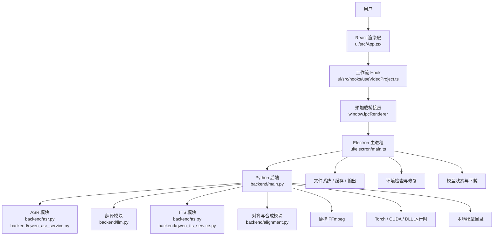
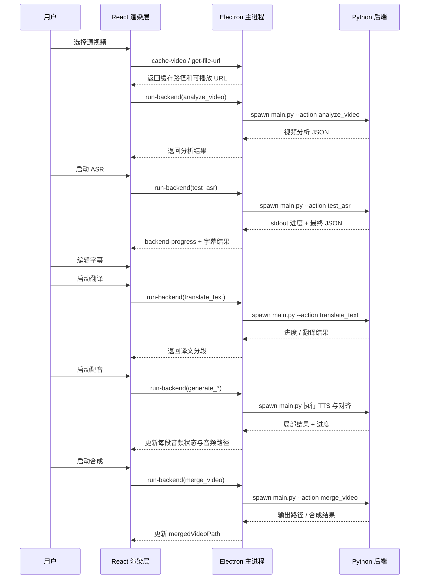

# VideoSyncMaster 架构分析文档

## 1. 文档目的

本文档用于完整说明 `VideoSyncMaster` 当前项目的技术架构、模块职责、业务流程、调用链路以及各业务逻辑之间的关系，帮助开发人员快速建立全局理解。

适用对象：

- 新接手项目的开发人员
- 准备进行重构的开发人员
- 需要定位问题归属的开发人员
- 需要扩展新功能的开发人员

本文档聚焦的是：

- 当前代码是怎么组织的
- 当前产品流程是怎么落地到代码里的
- UI、Electron、Python 三层是如何协作的
- 当前架构为什么能支撑现有流程
- 当前架构又在哪些地方已经开始限制后续开发

产品需求、待办、优先级和交付路线图，单独维护在 [todo.md](C:\Users\MI\Downloads\VideoSyncMaster\todo.md)。

---

## 2. 项目定位

`VideoSyncMaster` 是一个本地运行的 AI 视频本地化桌面工具，目标是让用户在一台机器上完成视频从识别到翻译、配音、对齐、合成的完整流程。

当前产品的核心能力链路是：

1. 导入视频或音频
2. 运行 ASR 生成字幕片段
3. 对字幕进行编辑与校验
4. 将字幕翻译到目标语言
5. 为目标字幕生成配音
6. 对音频时长进行对齐
7. 将音频重新合成进视频
8. 对原视频和结果视频进行预览与验证

从产品实现上看，当前系统采用的是桌面端典型的“前端界面 + 本地调度 + 本地 AI 处理引擎”模式。

---

## 3. 架构总览

整个系统可以分成四个主要层次：

1. React 渲染层
2. Electron 主进程层
3. Python 后端处理层
4. 本地运行时与资源层

### 3.1 React 渲染层

主要位于：

- `ui/src/App.tsx`
- `ui/src/hooks/useVideoProject.ts`
- `ui/src/components/*`

职责：

- 渲染界面
- 接收用户输入
- 管理当前工作流状态
- 调用桌面端能力
- 展示进度、局部结果和最终结果

### 3.2 Electron 主进程层

主要位于：

- `ui/electron/main.ts`
- `ui/electron/preload.ts`

职责：

- 创建桌面窗口
- 提供文件系统与原生能力
- 拉起 Python 子进程
- 将 Python 输出转换为前端可消费的事件
- 负责环境检查、依赖修复和模型下载等宿主能力

### 3.3 Python 后端处理层

主要位于：

- `backend/main.py`
- `backend/asr.py`
- `backend/alignment.py`
- `backend/llm.py`
- `backend/tts.py`
- `backend/qwen_tts_service.py`
- `backend/qwen_asr_service.py`

职责：

- 实际执行 AI 与媒体处理逻辑
- 组织 ASR、翻译、TTS、对齐和合成流程
- 管理模型路径与运行时初始化
- 调用 ffmpeg、Torch、模型推理等底层能力

### 3.4 本地运行时与资源层

主要位于：

- `python/`
- `backend/ffmpeg/`
- 运行期的 `models/`
- `.cache/`
- `output/`

职责：

- 提供内嵌 Python 运行时
- 提供便携 ffmpeg
- 存储模型文件
- 存储缓存文件和中间产物
- 存储最终导出结果

---

## 4. 仓库结构与意图

### 根目录关键内容

- `package.json`
  - 根命令入口，实际转发到 `ui/`
- `start.bat`
  - Windows 启动器，负责开发模式下的环境准备和启动
- `package_app.py`
  - 负责便携包和更新补丁包的打包
- `requirements.txt`
  - Python 依赖清单
- `backend/`
  - 核心处理逻辑
- `ui/`
  - Electron + React 应用
- `python/`
  - 内嵌便携 Python 运行时
- `asset/`
  - 图片与视觉资源
- `Qwen3-ASR/`
  - 与模型相关的资源目录
- `logs/`
  - 运行日志目录

### 前端相关文件

- `ui/src/main.tsx`
  - React 渲染入口
- `ui/src/App.tsx`
  - 主界面组合入口
- `ui/src/hooks/useVideoProject.ts`
  - 当前主流程的核心 hook
- `ui/src/components/VideoUpload.tsx`
  - 视频导入与预览
- `ui/src/components/Timeline.tsx`
  - 字幕时间轴
- `ui/src/components/TranslationPanel.tsx`
  - 翻译与配音操作区
- `ui/src/components/ModelManager.tsx`
  - 模型检查与下载管理

### Electron 相关文件

- `ui/electron/main.ts`
  - 主进程逻辑，承担桌面调度职责
- `ui/electron/preload.ts`
  - 渲染进程与主进程之间的桥接层

### Python 后端相关文件

- `backend/main.py`
  - Python 总控入口
- `backend/asr.py`
  - 语音识别逻辑
- `backend/alignment.py`
  - 音频对齐与音视频合成逻辑
- `backend/llm.py`
  - 翻译逻辑
- `backend/tts.py`
  - Index-TTS 路径
- `backend/qwen_tts_service.py`
  - Qwen TTS 路径
- `backend/qwen_asr_service.py`
  - Qwen ASR 路径
- `backend/check_requirements.py`
  - Python 依赖检查
- `backend/dependency_manager.py`
  - Python 依赖修复辅助

---

## 5. 当前运行模型

项目当前本质上是一个“本地桌面壳 + Python 动作调度器”。

前端不直接执行重型媒体逻辑，而是负责：

1. 接收用户意图
2. 调用 Electron IPC
3. 由 Electron 将该意图转换为 Python action
4. 由 Python 执行具体处理
5. 将结果和进度返回给前端

也就是说，当前产品运行时是分布在三个进程中的：

- Renderer 进程
- Electron Main 进程
- Python 子进程

这是理解本项目的第一个核心点，因为很多问题都不是单层问题，而是跨层问题。

---

## 6. 模块关系图

---

## 7. 当前业务流程

### 7.1 当前主流程

当前产品主要围绕单条线性流程设计：

1. 选择一个视频
2. 缓存该视频并生成本地可播放路径
3. 分析编解码信息
4. 如果本地播放不兼容，则转码
5. 运行 ASR 生成字幕分段
6. 用户手工检查和编辑字幕
7. 翻译字幕
8. 生成配音
9. 对配音做时长对齐
10. 合成最终视频
11. 预览原视频与结果视频

### 7.2 当前流程特征

当前流程在设计上默认：

- 一次只处理一个源文件
- 一次只维护一套当前字幕
- 一次只维护一套当前译文
- 一次只运行一个主要处理任务
- 一次只针对一个当前输出结果进行预览

这也是为什么当前没有批量队列能力，因为系统天然是按“单活动项目”来组织的。

---

## 8. 端到端调用链

---

## 9. 前端架构详解

### 9.1 渲染入口

`ui/src/main.tsx` 主要负责挂载 React 应用并加载全局样式，本身比较轻。

真正的前端主逻辑，集中在：

- `App.tsx`
- `useVideoProject.ts`

### 9.2 App 容器的职责

`ui/src/App.tsx` 当前承担的是主页面组合器的角色，但实际上它不只是布局层，还承担了一部分流程控制职责。

它当前负责的内容包括：

- 主视图切换
- 左侧、时间轴、翻译区的布局宽度
- 时间轴与翻译区滚动联动
- 当前编辑片段状态
- 音视频播放联动
- 环境修复确认弹窗
- `home`、`models`、`asr`、`tts`、`translation`、`merge`、`about` 等视图切换

这意味着 `App.tsx` 当前具有双重角色：

- 页面容器
- 流程协调者

这也是前端复杂度上升的一个重要原因。

### 9.3 useVideoProject 的职责

`ui/src/hooks/useVideoProject.ts` 是当前渲染层真正的操作中心。

它目前集中管理：

- 视频路径
- 原始字幕分段
- 翻译后的字幕分段
- loading 与 progress
- ASR / TTS / 语言配置
- 本地持久化配置
- 反馈弹窗
- 后端进度事件监听
- 各种主流程 handler

从架构角色上看，它实际上混合承担了：

- 项目状态存储层
- 应用服务层
- 工作流编排层
- Electron 事件接收适配层

这正是它不断膨胀的根本原因。

### 9.4 关键前端组件与业务关系

#### VideoUpload.tsx

职责：

- 处理文件选择与拖拽
- 请求缓存文件
- 请求视频编解码分析
- 必要时触发转码
- 设置视频预览地址

业务意义：

- 它是整个流程的入口
- 它的预览状态直接影响后续源视频播放体验
- 它和合成后预览之间存在天然关联

#### Timeline.tsx

职责：

- 展示字幕时间片段
- 提供字幕片段编辑与定位能力

业务意义：

- 它承担的是“源内容校验层”
- 是 ASR 结果进入后续翻译前的关键检查位置

#### TranslationPanel.tsx

职责：

- 展示译文片段
- 触发翻译和配音
- 展示每段音频状态

业务意义：

- 它是字幕处理向语音生成过渡的核心操作区

#### ModelManager.tsx

职责：

- 检查模型状态
- 显示模型根目录
- 发起模型下载与取消下载

业务意义：

- 它决定当前系统能否启用对应 ASR/TTS 路径
- 属于流程外但非常关键的运行支持模块

---

## 10. Electron 架构详解

### 10.1 preload 层

`ui/electron/preload.ts` 当前直接向 renderer 暴露了通用 `ipcRenderer` 能力。

当前暴露形态包括：

- `on`
- `off`
- `send`
- `invoke`

优点是：

- 前期开发快
- 接口接入成本低

问题是：

- 页面层知道太多 IPC 细节
- channel 名散落在业务代码里
- 后续类型收敛和安全收敛难度更大

### 10.2 main.ts 作为桌面调度中心

`ui/electron/main.ts` 当前是桌面端真正的宿主调度器。

它负责：

- 创建窗口
- VC++ Runtime 检查与安装
- 文件 URL 生成
- 文件保存和目录创建
- 打开文件选择框和保存框
- 项目路径计算
- 拉起 Python 后端
- 解析后端 stdout/stderr
- 转发进度与局部结果给 renderer
- 任务取消
- 打开日志
- Python 环境检查和修复
- 模型状态检查
- 模型下载
- 其他文件下载
- 视频缓存

也就是说，`main.ts` 当前同时承担三种角色：

1. 桌面壳管理器
2. Python 调度器
3. 环境与资源管理器

这是整个项目里最关键也最容易继续膨胀的文件之一。

### 10.3 Electron 与后端的核心契约

最关键的 Electron 契约是 `run-backend`。

其逻辑是：

- renderer 传入一组类似 CLI 的参数
- main.ts 解析项目根路径
- main.ts 解析 Python 可执行文件路径
- main.ts 找到 `backend/main.py`
- 通过 `spawn` 拉起 Python
- 监听 stdout/stderr
- 把进度和局部结果转成前端事件
- 从 stdout 中解析最终 JSON

这条链路就是当前整个产品的运行骨架。

---

## 11. Python 后端架构详解

### 11.1 backend/main.py 的实际角色

`backend/main.py` 不只是一个简单入口脚本，它当前实际上承担的是 Python 侧控制平面角色。

它当前混合了以下职责：

- 启动初始化
- 便携 Python 重启
- 日志初始化
- 模型路径探测
- ffmpeg 路径设置
- GPU DLL 路径修复
- action 路由
- 业务流程组织

它是后端处理层的总控中心。

### 11.2 action 执行模型

当前后端是通过 `--action` 模式工作的。

常见 action 包括：

- 视频分析
- 视频转码
- ASR
- 翻译
- TTS 生成
- 音频对齐
- 视频合成
- 文件校验

这说明当前后端不是一个常驻 API 服务，而更像一个“本地命令式动作执行器”。

这会带来几个直接特点：

- 启动开销频繁出现
- 环境初始化质量非常关键
- stdout 协议非常关键
- 每个 action 的行为一致性非常关键

### 11.3 后端子模块职责

#### asr.py

负责语音识别与字幕分段。

业务作用：

- 为整条流程生成第一份结构化文本时间线

#### llm.py

负责翻译与文本处理。

业务作用：

- 将校验后的源字幕转换为目标语言字幕

#### tts.py 和 qwen_tts_service.py

负责语音生成。

业务作用：

- 把目标语言字幕转换成可用于合成的语音文件

#### alignment.py

负责时长对齐与最终音视频合成相关逻辑。

业务作用：

- 让每段音频尽量贴近原字幕时长
- 将全部音频重新合并进视频

### 11.4 运行时路径逻辑

由于项目要同时支持：

- 开发模式
- 打包模式
- 便携 Python 模式

因此 `backend/main.py` 中存在大量路径和环境初始化逻辑，例如：

- Python 解释器路径解析
- 模型缓存目录解析
- ffmpeg 路径挂载
- CUDA / DLL 搜索路径修复
- 日志目录选择

这也是它体积膨胀的重要原因之一。

---

## 12. 核心数据与状态流

### 12.1 核心 UI 状态对象

当前前端状态主要围绕几个核心对象展开：

- `videoPath`
- `originalVideoPath`
- `mergedVideoPath`
- `segments`
- `translatedSegments`
- `progress`
- `loading`

尽管项目里没有显式的状态机实现，但这些对象实际上已经形成了一个隐式状态机。

### 12.2 字幕片段的生命周期

字幕片段是整个产品最关键的业务实体之一。

它的生命周期是：

1. 由 ASR 生成
2. 展示在时间轴中
3. 被用户编辑
4. 进入翻译流程
5. 被赋予配音状态
6. 被写入音频路径
7. 必要时进行时长对齐
8. 被最终用于视频合成

这意味着字幕片段是连接以下几个模块的桥梁：

- 媒体识别
- 文本翻译
- 语音生成
- 视频合成

### 12.3 媒体路径的生命周期

一个源视频在当前流程中可能经历多层路径形态：

1. 用户选择的原始路径
2. 缓存路径
3. 如果本地播放不兼容，则转码后的路径
4. 合成输出路径

这点非常重要，因为当前合成后播放闪烁问题，很可能就和这些路径之间的切换逻辑有关。

---

## 13. 各业务逻辑之间的关系

这一节从业务依赖角度说明各能力之间的关系。

### 13.1 视频导入依赖本地可播放性

业务目标：

- 用户导入后可以稳定预览源视频

实现关系：

- `VideoUpload.tsx` 请求 Electron 缓存文件
- 再请求 `analyze_video`
- 如有需要再触发 `transcode_video`
- 最终生成 renderer 可播放的 URL

依赖链：

- React 预览逻辑
- Electron 路径能力
- Python 视频分析能力
- ffmpeg 与本机编解码兼容性

### 13.2 ASR 依赖正确的输入路径和运行环境

业务目标：

- 为源视频生成字幕分段

实现关系：

- 前端使用当前 `originalVideoPath`
- Electron 通过 `run-backend` 触发 `test_asr`
- 后端根据 ASR 引擎和输出目录生成字幕分段

依赖链：

- 输入路径正确
- Python 运行时可用
- 模型可用
- ASR 引擎与配置可用

### 13.3 翻译依赖稳定的字幕结构

业务目标：

- 将源字幕转换为目标语言字幕

实现关系：

- 前端将当前字幕段序列化为 JSON
- 后端根据翻译配置执行翻译
- 前端用返回结果替换占位内容

依赖链：

- 字幕顺序稳定
- 字幕文本有效
- 目标语言明确
- 翻译配置有效

### 13.4 配音依赖翻译结果和时长约束

业务目标：

- 为目标字幕生成自然且可落入原时间轴的语音

实现关系：

- 翻译结果被传给后端
- 后端按段生成语音
- 局部结果实时回传
- 每段状态和时长回填到前端

依赖链：

- 翻译文本质量
- TTS 引擎可用
- 模型可用
- 时长约束可满足
- 对齐策略有效

### 13.5 合成依赖音频状态完整

业务目标：

- 生成最终本地化视频

实现关系：

- 合成动作消费源视频和所有音频片段
- 后端执行音视频合成
- 前端更新 `mergedVideoPath`

依赖链：

- 源视频路径有效
- 音频文件存在
- 字幕时间轴与音频对应关系正确
- ffmpeg 可用

### 13.6 预览依赖源视频与结果视频状态隔离

业务目标：

- 用户可以稳定预览原视频和结果视频

实现关系：

- 当前前端状态中同时维护源视频与合成视频相关路径
- 但预览控制仍然依附于较重的页面级工作流状态

当前风险：

- 原视频与结果视频的预览状态没有完全独立
- 预览逻辑与工作流逻辑耦合较高
- 切换时容易触发大范围状态更新

这正是当前“播放闪烁”问题的重要架构背景。

---

## 14. 当前架构的关键假设

### 14.1 单活动项目假设

当前系统天然假设：

- 一个活动源文件
- 一套当前字幕
- 一个当前翻译目标
- 一个当前配音流程
- 一个当前合成结果

这使当前代码可以相对直接，但也天然限制了队列式批量处理。

### 14.2 单活动后端任务假设

当前 renderer 与 Electron 的设计，基本上都在假设同一时间只有一个重要的活动后端任务。

这影响了：

- 任务取消能力
- 进度展示方式
- 状态栏文本
- 最终结果归属

因此，当前系统并不是围绕“多任务调度器”构建的。

### 14.3 路径驱动假设

当前很多业务能力是围绕具体文件路径组织的，而不是围绕抽象的“项目”或“任务对象”组织的。

这带来的问题是：

- 路径变化会跨层传播
- 预览状态与输出状态容易相互影响
- 队列能力接入时，需要更明确的任务对象抽象

---

## 15. 当前架构的主要风险

### 15.1 控制型文件过大

当前几个关键控制文件承担了过多职责：

- `ui/src/App.tsx`
- `ui/src/hooks/useVideoProject.ts`
- `ui/electron/main.ts`
- `backend/main.py`

这会带来：

- 更高的改动回归风险
- 更高的阅读成本
- 更差的可测试性

### 15.2 IPC 边界封装不足

当前 preload 直接暴露通用 IPC 能力。

这会带来：

- renderer 对 channel 细节过度依赖
- 类型管理困难
- 接口稳定性差

### 15.3 后端事件协议偏脆弱

当前进度与局部结果依赖 stdout 文本标记。

这会带来：

- 解析脆弱
- action 越多越难维护
- 一旦输出格式稍变，前端就可能出错

### 15.4 预览状态与工作流状态混合

当前预览控制逻辑和业务工作流逻辑挨得太近。

这会带来：

- 播放 bug 难隔离
- 切换源视频和结果视频时更容易闪烁
- 后续若做并排对比或批量预览，复杂度会进一步上升

### 15.5 缺乏一等任务模型

当前项目有项目状态，但还没有真正的一等任务/作业模型。

这会带来：

- 无法自然支持队列
- 无法自然支持批量处理
- 无法自然支持更清晰的任务恢复与状态追踪

---

## 16. 开发者阅读建议

如果是新接手本项目，建议按下面顺序阅读代码：

1. `ui/src/App.tsx`
   - 先理解页面结构和主要交互
2. `ui/src/hooks/useVideoProject.ts`
   - 理解当前工作流状态和 handler 入口
3. `ui/electron/main.ts`
   - 理解前端如何调度到 Python
4. `backend/main.py`
   - 理解 Python 总控入口与 action 分发
5. `backend/asr.py`、`backend/llm.py`、`backend/tts.py`、`backend/alignment.py`
   - 理解具体业务域逻辑
6. `ui/src/components/VideoUpload.tsx`、`TranslationPanel.tsx`、`ModelManager.tsx`
   - 理解用户高频操作点

---

## 17. 当前架构结论

`VideoSyncMaster` 当前已经具备一个完整的桌面产品骨架：

- 本地媒体导入
- 字幕识别
- 字幕编辑
- 翻译
- 配音
- 合成
- 环境管理
- 模型管理

当前真正的挑战已经不是“功能链路是否存在”，而是：

- 核心流程越来越集中在少数几个大文件里
- 当前系统是围绕单项目、单任务模型构建的
- 预览、工作流和后端调度之间的边界还不够清晰

实际含义是：

- 现有产品还能继续迭代
- 但继续叠加功能会越来越容易放大耦合
- 批量处理、队列、稳定预览等能力，都会推动系统走向更清晰的任务模型和边界设计

总结来说，当前架构已经足以支撑产品继续演进，但也已经明确到了需要结构化整理的阶段。
